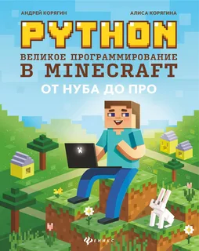

#  MinecraftAPI
> [!TIP]<br/>
> Это репозиторий с кодом, который появится в ходе прочения книги<br/>
> <span style="color:blue">"PYTHON Великое програмирование в MINECRAFT от НУДА ДО ПРО"</span> <br/>

---

## Структура проета

|Ресурс|Описание|
|---:|:---|
|[docs](./docs)| Документация по проекту|

# Правила офомления коммитов и веток

## Ветки

- `master` - только стабильные и проверенные временем версии
- `develop` - свежие, но менее стабильные изменения
- `<others>` - отдельные ответвления, которые скорее всего должны в скором времени залиться в master или develop, но они вообще могут не работать

## Шаблон ккоммита

```text
[категория](ресурс@версия): краткое описание измениний
```

**Где:**

- `категория`: feat | fix | docs | chore
- `ресурс`: название урока или программного решения
- `версия`: текущая верисия

## Шаблон назначения категорий

- `feat(имя@1.0.0)`: Добавление функционала
- `fix(имя@1.0.1)`: Исправление багов
- `chore(имя@1.1.0): Незначительные улучшения или технические правки

> [!NOTE]
> Если увеличивается старшая цифра версии, все правые обнуляются

## Теги

- Тег формируется так:

```bash
git tag имя-сервиса-vX.Y.Z -m "Описание версии"
git push origin имя-сервиса-vX.Y.Z 
```

# Планы на будующее

- Написать много интерактивных игр :-), прервая на подходе хранитель гробницы!

